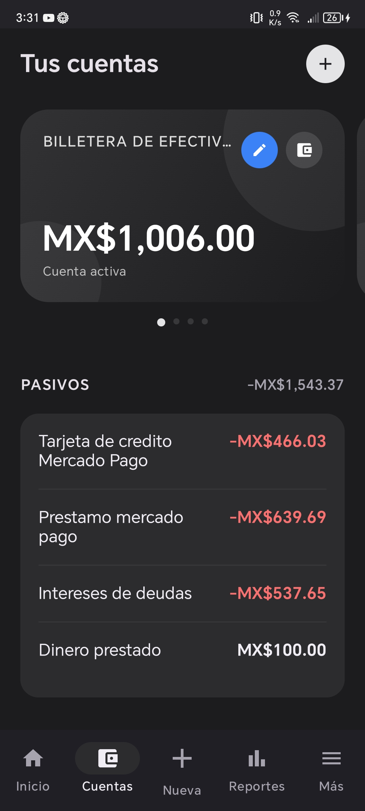
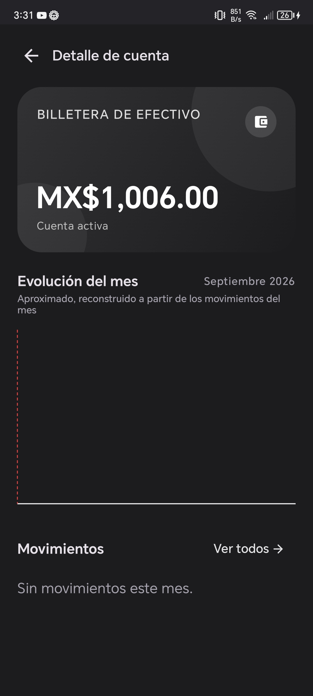
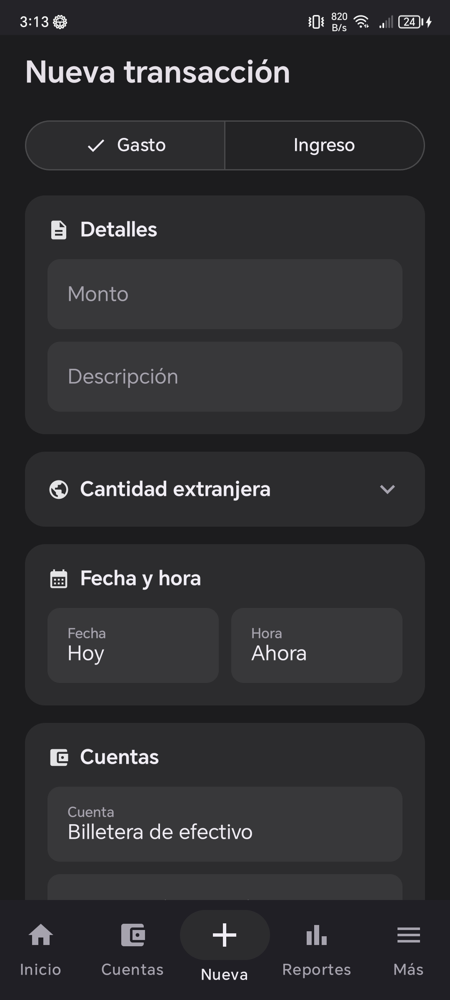

# AppFireflyIII

Aplicación móvil Android, no oficial, para [Firefly III](https://www.firefly-iii.org/), el gestor de finanzas personales de código abierto. Permite consultar y administrar tus cuentas, transacciones, presupuestos y reportes directamente desde el celular, conectándose a tu propia instancia de Firefly III mediante su API REST.

## Capturas de pantalla

<p align="center">
  
  
  
</p>


## Características

- **Dashboard** con patrimonio neto, ingresos y gastos del mes en curso, y los últimos movimientos del mes.
- **Cuentas** — listado, detalle con evolución diaria del saldo, creación y edición de cuentas.
- **Movimientos** — listado filtrable por mes, por tipo (ingreso/gasto) y por cuenta, con detalle de cada transacción.
- **Nueva transacción** — formulario completo: monto, descripción, cuenta, categoría, presupuesto, etiquetas, notas, moneda extranjera y fecha/hora personalizada.
- **Reportes** — visualización de ingresos y gastos por período.
- **Autenticación biométrica** para proteger el acceso a la app tras configurarla.
- **Conexión vía Personal Access Token** a cualquier instancia propia de Firefly III (self-hosted o en la nube).
- Tema oscuro por defecto, diseñado con Jetpack Compose y Material 3.

## Tecnologías

- **Kotlin** + **Jetpack Compose**
- Arquitectura **MVVM** 
- **Retrofit** para el consumo de la API REST de Firefly III
- **Navigation Compose** para la navegación entre pantallas
- Autenticación biométrica con **AndroidX Biometric**

## Estructura del proyecto

```
app/src/main/java/com/example/appfireflyiii/
├── auth/               # Autenticación biométrica
├── data/
│   ├── model/          # Modelos de datos (Account, Budget, Transaction...)
│   ├── network/         # Cliente API, endpoints y almacenamiento del token
│   └── repository/      # Repositorios (Account, Budget, Transaction)
├── navigation/          # Definición de rutas (Screen.kt)
├── ui/
│   ├── components/      # Componentes compartidos (bottom nav, tabs)
│   ├── screens/          # Una carpeta por pantalla (dashboard, accounts, transactions...)
│   └── theme/            # Colores, tipografía y tema de la app
└── util/                 # Formateadores y utilidades
```

## Requisitos previos

- Android Studio (última versión estable recomendada)
- JDK 17 o superior
- Una instancia de Firefly III accesible (self-hosted o en un servidor propio) con un **Personal Access Token** generado desde `Perfil de usuario → OAuth → Personal Access Tokens`

## Instalación y ejecución

1. Clona el repositorio:
   ```bash
   git clone https://github.com/Elio6174/AppfireflyIII.git
   ```
2. Ábrelo en Android Studio y espera a que sincronice Gradle.
3. Ejecuta la app en un emulador o dispositivo físico.
4. En el primer inicio, ingresa la **URL de tu instancia de Firefly III** y tu **Personal Access Token**.
5. Configura la autenticación biométrica si tu dispositivo lo permite.

## Estado del proyecto

Proyecto en desarrollo activo. Próximas mejoras planeadas:
- [ ] Soporte multi-moneda más completo en reportes
- [ ] Notificaciones de presupuesto excedido
- [ ] Widget de inicio con resumen del mes

## Licencia

Este proyecto no está afiliado oficialmente con Firefly III. Ver [firefly-iii/firefly-iii](https://github.com/firefly-iii/firefly-iii) para el proyecto original.
